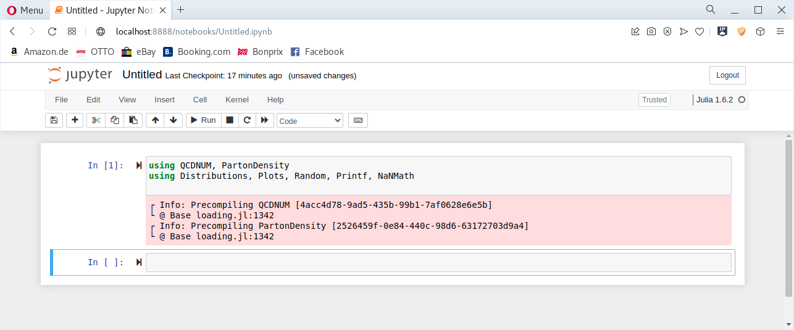

# Use QCDNUM in Jupyter notebook

The simplest way to use the QCDNUM in the Jupyter notebook after the installation is 

- To create a virtual python environment with an ad-hoc name `myjuliav`
```
[user@host workdirectory]$ python -m venv myjuliav
```

- Activate the virtual environment
```
[user@host workdirectory]$ source myjuliav/bin/activate.sh
```

- Install the Jupyter notebook package using `pip`
```
(myjuliav) [user@host workdirectory]$ python -m pip install notebook
```

- Launch the notebook 
```
(myjuliav) [user@host workdirectory]$ jupyter notebook
```
and follow the instructions that will be shown on the screen.

# In the notebook

- Create a new  notebook 


- Start to use QCDNUM


